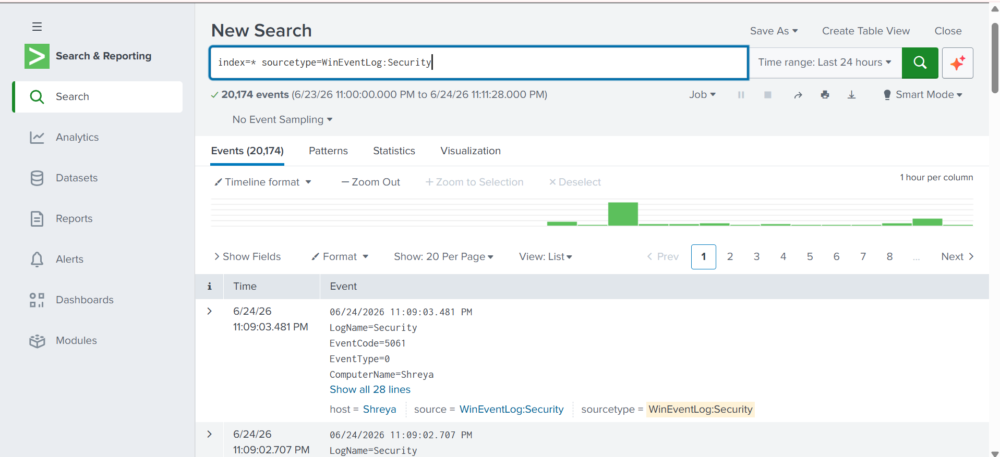
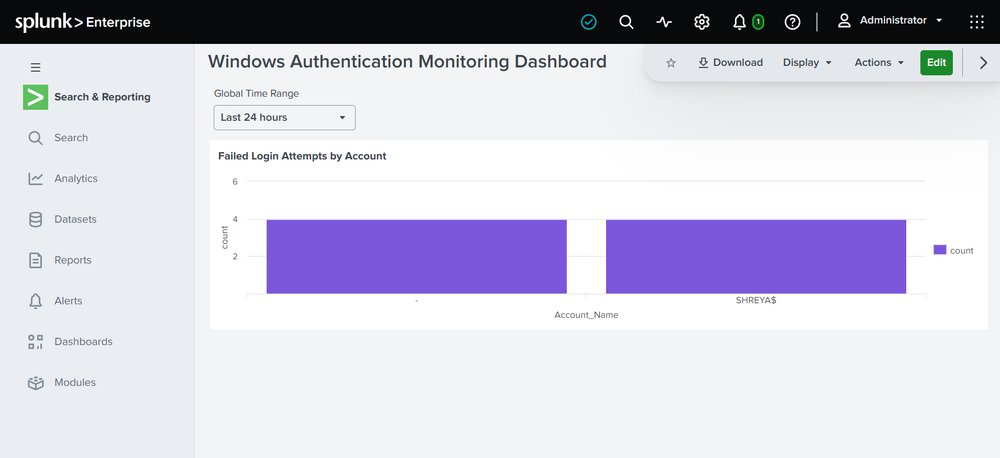
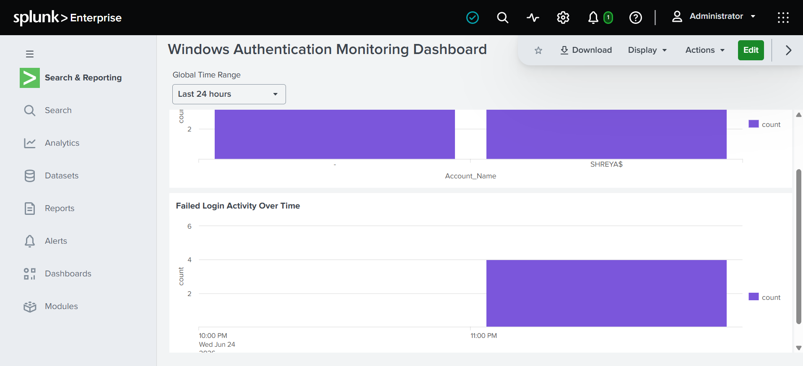
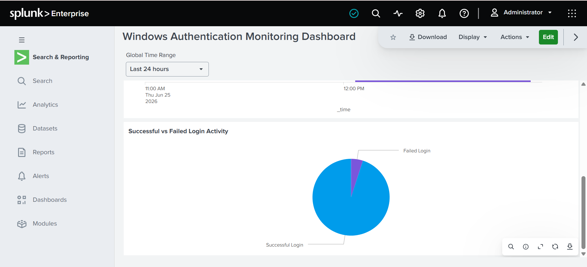
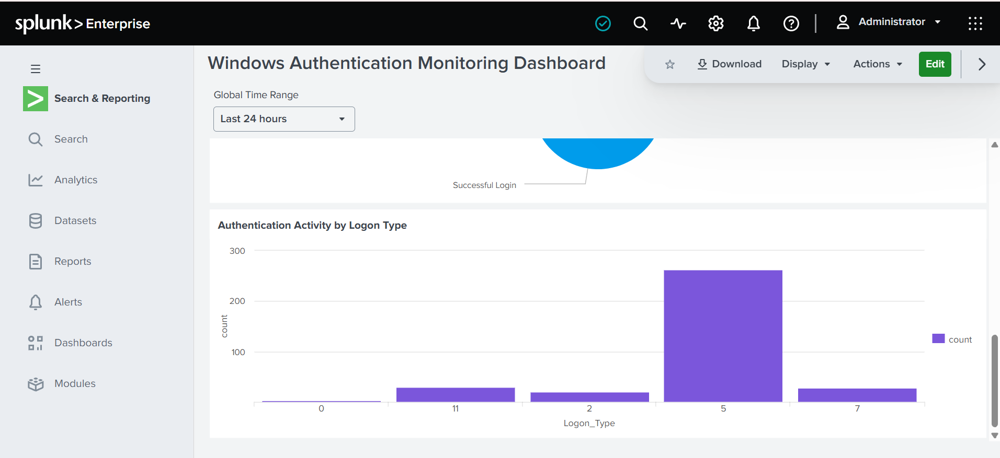
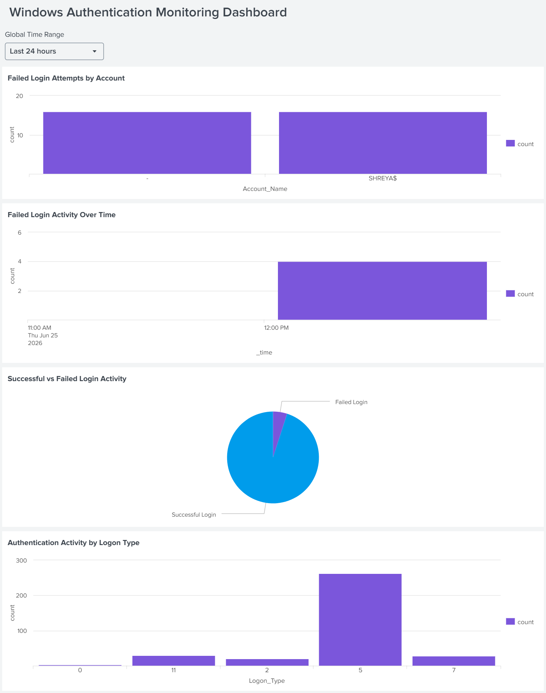
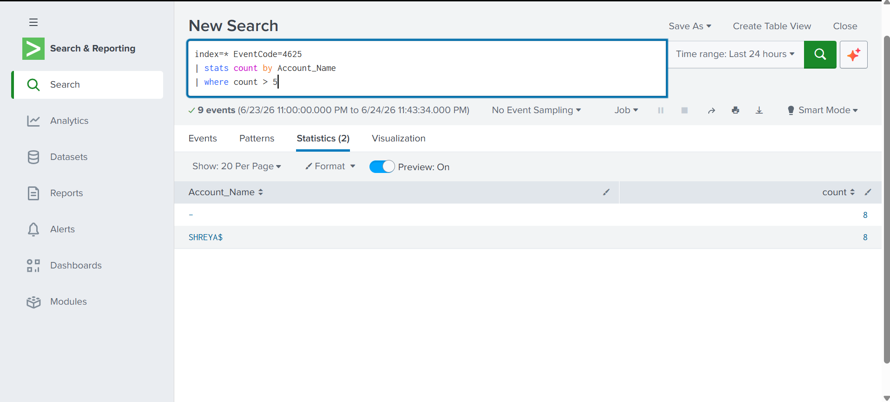
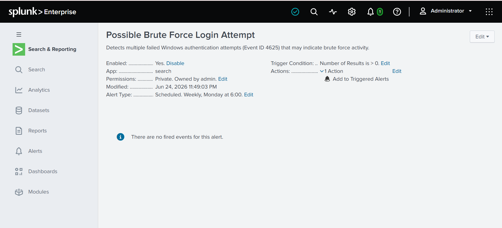

# Splunk Windows Authentication Monitoring and Brute Force Detection Lab

## Overview

This project demonstrates the deployment of Splunk Enterprise and Splunk Universal Forwarder to collect, analyze, and monitor Windows Security Event Logs. The lab focuses on authentication monitoring, failed login detection, dashboard creation, alerting, and investigation of potential brute-force login activity.

The environment was built on Windows 11 and uses Splunk Search Processing Language (SPL) to identify suspicious authentication behavior and visualize security-relevant events.

---

## Architecture

```text
Windows 11
     |
     v
Splunk Universal Forwarder
     |
     v
Splunk Enterprise
     |
     +--> SPL Searches
     +--> Dashboards
     +--> Alerts
     +--> Investigations
```

---

## Tools Used

- Splunk Enterprise
- Splunk Universal Forwarder
- Windows 11
- SPL (Search Processing Language)

---

## Data Sources

### Windows Security Event Logs

| Event ID | Description |
|-----------|-------------|
| 4624 | Successful Logon |
| 4625 | Failed Logon |

---

## Project Objectives

- Ingest Windows Security Event Logs into Splunk
- Monitor authentication activity
- Detect failed login attempts
- Identify accounts experiencing repeated authentication failures
- Create dashboards for security monitoring
- Configure alerts for potential brute-force attacks
- Perform event investigation using SPL

---

## Log Ingestion

Windows Security Event Logs were collected using Splunk Universal Forwarder and sent to Splunk Enterprise for analysis.

### Log Collection Verification



---

## Dashboard Overview

### 1. Failed Login Attempts by Account

Displays failed authentication attempts grouped by account.



---

### 2. Failed Login Activity Over Time

Visualizes failed authentication events over time.



---

### 3. Successful vs Failed Login Activity

Compares successful and failed authentication activity.



---

### 4. Authentication Activity by Logon Type

Shows authentication activity grouped by Windows logon types.



---

## Complete Dashboard



---

## Detection Queries

### Failed Login Detection

```spl
index=* EventCode=4625
```

### Failed Login Attempts by Account

```spl
index=* EventCode=4625
| stats count by Account_Name
| sort - count
```

### Successful vs Failed Login Activity

```spl
index=* (EventCode=4624 OR EventCode=4625)
| eval LoginStatus=if(EventCode=4624,"Successful Login","Failed Login")
| stats count by LoginStatus
```

### Authentication Activity by Logon Type

```spl
index=* (EventCode=4624 OR EventCode=4625)
| stats count by Logon_Type
```

### Potential Brute Force Detection

```spl
index=* EventCode=4625
| stats count by Account_Name
| where count > 5
```

---

## Investigation Workflow

A controlled brute-force scenario was simulated by generating multiple failed Windows login attempts.

### Investigation Steps

1. Identify failed authentication events (Event ID 4625)
2. Determine affected accounts
3. Review authentication trends
4. Analyze logon types
5. Compare successful and failed login activity
6. Evaluate whether activity meets alert thresholds

### Brute Force Detection Search



---

## Alert Configuration

### Alert Name

**Possible Brute Force Login Attempt**

### Alert Logic

```spl
index=* EventCode=4625
| stats count by Account_Name
| where count > 5
```

### Configuration

- Alert Type: Scheduled
- Schedule: Every Hour
- Trigger Condition: Number of Results > 0
- Severity: Medium
- Action: Add to Triggered Alerts

### Alert Screenshot



---

## Results

- Successfully deployed Splunk Enterprise and Splunk Universal Forwarder.
- Ingested Windows Security Event Logs into Splunk.
- Generated and detected failed authentication events (Event ID 4625).
- Built multiple authentication monitoring dashboard panels.
- Created a threshold-based alert for potential brute-force activity.
- Performed authentication event investigations using SPL.
- Visualized authentication trends and logon behavior.

---

## Skills Demonstrated

- SIEM Administration
- Log Collection and Management
- Windows Event Analysis
- Security Monitoring
- Threat Detection
- SPL Query Development
- Dashboard Development
- Alert Configuration
- Incident Investigation

---

